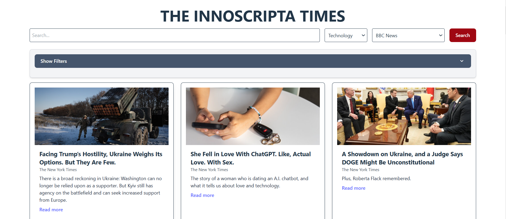

<div align="center">
  <h1><b>📰 InnoScripta NewsRoom 📰</b></h1>
  
  <p>
    THE INNOSCRIPTA TIMES is a cutting-edge news platform that allows you to browse articles from a variety of sources with an ultra-smooth infinite scroll experience. Developed with React, Vite, and TypeScript, it features a dynamic grid layout where news cards and their loading placeholders seamlessly integrate, ensuring a consistently fluid and gap-free display even as new content loads.
  </p>
  <p>
    Powered by the <a href="https://newsapi.org/" target="_blank">News API</a>, <a href="https://developer.nytimes.com/docs/articlesearch-product/1/overview" target="_blank">New York Times API</a>, and <a href="https://open-platform.theguardian.com/documentation/" target="_blank">Guardian API</a>, this application brings you the latest news articles with an engaging user experience.
  </p>
  
  
  
  
  
  
</div>

---

## Getting Started

These instructions will help you set up a copy of the project on your local machine for development, testing, and production purposes.

### Features

1. Infinite scrolling for a smooth reading experience

2. Dynamic grid layout for seamless content display

3. Built using React, Vite, and TypeScript for performance and maintainability

### Prerequisites

To run this project, ensure you have the following installed:

- **Node.js** (v18 or later) and **npm** or **Yarn**
- **Docker** (if you plan to run the app inside a container)
  - [Docker for Windows](https://docs.docker.com/desktop/install/windows-install/)
  - [Docker for macOS](https://docs.docker.com/desktop/install/mac-install/)
  - [Docker for Linux](https://docs.docker.com/desktop/install/linux-install/)

---

## 🗒️ INSTALLATION

### Local Installation

1. **Clone the repository:**

   ```bash
   git clone https://github.com/franklinwagbara/news-aggregator-app-main.git
   ```

2. **Change directory into the cloned repo:**

   ```bash
   cd news-aggregator-app-main
   ```

3. **Install dependencies:**

   ```bash
   npm install
   ```

4. **Run the application:**

   ```bash
   npm run dev
   ```

   The application will start at http://localhost:3000/.

### Local Installation via Docker

1. **Clone the repository:**

   ```bash
   git clone https://github.com/franklinwagbara/news-aggregator-app-main.git
   ```

2. **Change directory into the cloned repo:**

   ```bash
   cd news-aggregator-app-main
   ```

3. **Build the Docker image:**

   ```bash
   docker build --no-cache -t news-aggregator-app-main .
   ```

4. **Run the Docker container:**

   ```bash
   docker run -p 3000:3000 -ti news-aggregator-app-main
   ```

## Steps to Deploy via Docker Compose

1. **Clone the Repository**

   ```bash
   git clone https://github.com/franklinwagbara/news-aggregator-app-main.git
   cd innoscripta-times
   ```

2. **Create a .env File**

   ```bash
   Duplicate .env.example and rename it to .env. Update any required environment variables. Or you can use the variables contained therein, although I can not guarantee the validity of the token by the time you use this application.
   ```

3. **Start the Application** Run the following command to start the application using Docker Compose:

   ```bash
   docker compose up --build
   ```

   This will build and run the necessary services as defined in the docker-compose.yml file.

4. **Access the Application** Once the services are running, access THE INNOSCRIPTA TIMES in your browser at:

   ```bash
   http://localhost:3000
   ```

5. **Stopping the Application** To stop the application, press CTRL + C in the terminal or run:
   ```bash
   docker compose down
   ```

## Project Overview

- **Infinite Scrolling with Seamless Layout:**
  The application leverages react-infinite-scroll-component to dynamically load more articles as you scroll. Both article cards and skeleton loaders are rendered in a unified grid layout to ensure a continuous flow without disruptive layout gaps.

- **Responsive Grid Layout:**
  Using CSS Grid, the articles and their corresponding skeleton loaders adjust naturally to various screen sizes, providing a consistent and responsive experience.

- **Modern Tooling & Fast Development:**
  Built with Vite, React, and TypeScript, this project benefits from fast hot module replacement and optimized builds, ensuring a smooth development workflow.

- **Dockerized Deployment:**
  The project includes a Docker setup for easy containerization, enabling consistent deployments across different environments.

## License

This project is licensed under the MIT License. See the LICENSE.md file for details.
